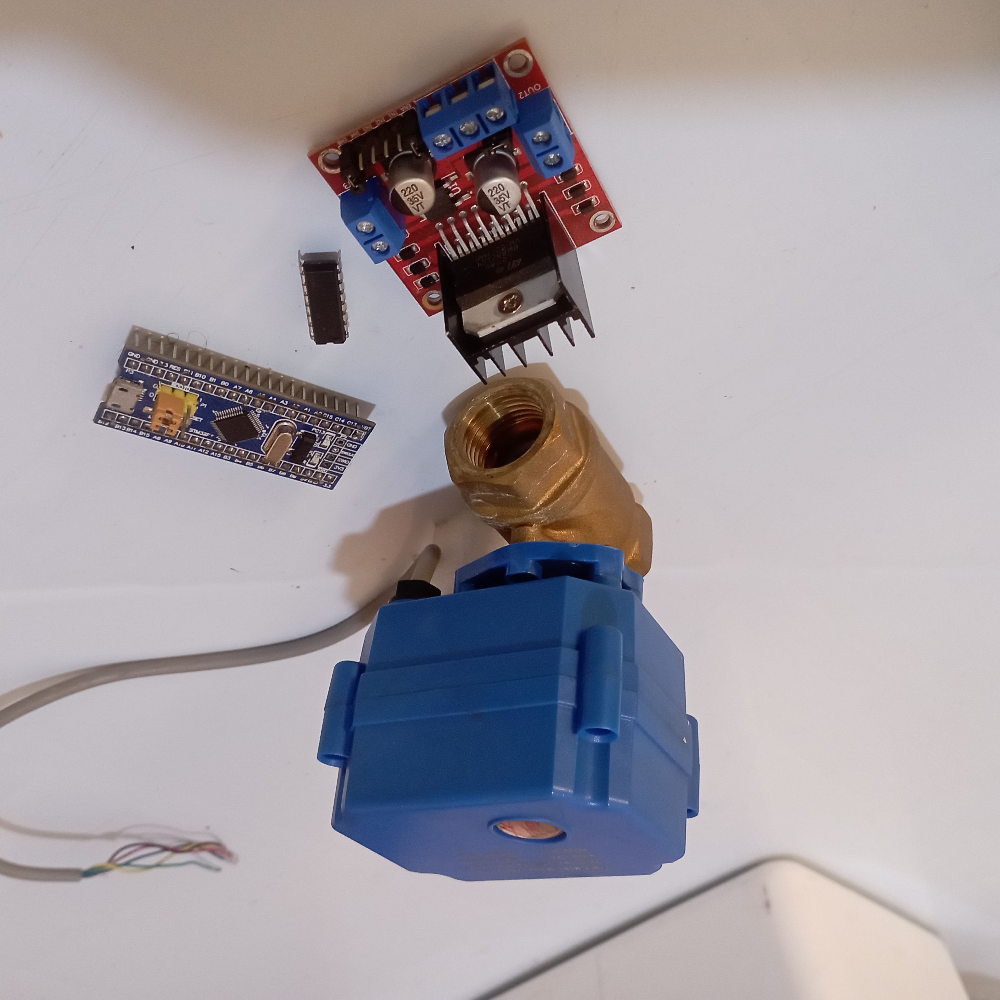

<p align="center">
  <a href="" rel="noopener">
 </a>
</p>

<h3 align="center">DN15 Motorized Ball Valve with L293D - FreeRTOS</h3>

<div align="center">

[]()
[](https://github.com/kylelobo/The-Documentation-Compendium/issues)
[](https://github.com/kylelobo/The-Documentation-Compendium/pulls)
[](/LICENSE)

</div>

---

<p align="center"> Using motor driver to control motorized ball valve via FreeRTOS
    <br> 
</p>

## 📝 Table of Contents

- [About](#about)
- [Getting Started](#getting_started)
- [Deployment](#deployment)
- [Usage](#usage)
- [Built Using](#built_using)
- [TODO](../TODO.md)
- [Contributing](../CONTRIBUTING.md)
- [Authors](#authors)
- [Acknowledgments](#acknowledgement)

## 🧐 About <a name = "about"></a>

The project is basically using motor driver to control motorized ball valve via FreeRTOS

## 🏁 Getting Started <a name = "getting_started"></a>

These instructions will get you a copy of the project up and running on your local machine for development and testing purposes. See [deployment](#deployment) for notes on how to deploy the project on a live system.

## Prerequisites

What things you need to install the software and how to install them.

```
Visual Studio Code
PlatformIO
STM32FreeRTOS
```

## 🎈 Usage <a name="usage"></a>

Assemble all the components and watch the magic happen.

## 🚀 Deployment <a name = "deployment"></a>

Upload the sketch to STM32F103C8T6 via FTDI

## ⛏️ Built Using <a name = "built_using"></a>

- [Visual Studio Code](https://code.visualstudio.com/) - Code Editor
- [PlatformIO](https://platformio.org/) - IDE
- [Arduino](https://www.arduino.cc/) - Embedded Framework
- [FreeRTOS](https://www.freertos.org/) - Real-time operating system

## ✍️ Authors <a name = "authors"></a>

- [@fanuelconrad](https://github.com/FanuelConrad) - Idea & Initial work

See also the list of [contributors](https://github.com/kylelobo/The-Documentation-Compendium/contributors) who participated in this project.

## 🎉 Acknowledgements <a name = "acknowledgement"></a>

- [Micro-controllers Lab](https://microcontrollerslab.com/use-freertos-arduino/) - How to use FreeRTOS with Arduino – Real-time operating system
